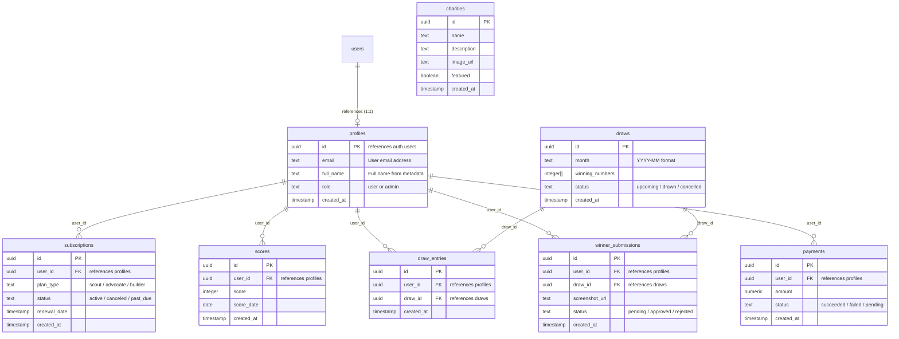

# Fundora Database Documentation

This directory manages database structures, schemas, and configurations for Supabase.

---

## Connection Guide
To connect a new Supabase project to the Fundora Next.js application:

1. **Create Project**: Sign in to [Supabase Console](https://supabase.com) and click **New Project**.
2. **Execute Migrations**:
   - Option A: Copy the contents of [`supabase/migrations/20260620000000_init.sql`](file:///c:/Users/himan/OneDrive/Desktop/Fundora/supabase/migrations/20260620000000_init.sql) and execute them directly inside the **SQL Editor** in the Supabase Dashboard.
   - Option B: Use the Supabase CLI:
     ```bash
     supabase login
     supabase link --project-ref your-project-ref
     supabase db push
     ```
3. **Set Environment Variables**: Update your local `.env.local` file with the keys found in the **Project Settings -> API** section of your Supabase dashboard:
   ```
   NEXT_PUBLIC_SUPABASE_URL=https://your-project-ref.supabase.co
   NEXT_PUBLIC_SUPABASE_ANON_KEY=eyJhbGciOi...
   ```

---

## Schema Architecture

Below is the Entity Relationship structure mapping out the database tables:



---

## Security Policies & RLS
Row Level Security (RLS) is enabled globally across all tables.

### Recursion Prevention Helper
To prevent policy recursion issues when validating admin flags on the `profiles` table, we use the custom security definer function:
- `public.is_admin(user_id uuid)`: Runs with creator privileges, querying roles directly and safely.

### General RLS Mapping
- **`profiles`**: Viewable by authenticated users (needed for leaderboard displays). Users can update only their own profile details. Admins have full access.
- **`charities`**: Read-only access enabled for everyone (unauthenticated/guest view allowed). Write privileges reserved for admin role.
- **`subscriptions` / `payments`**: Users can select/view only their own records. Modifying actions restricted to admins (webhook processes).
- **`draw_entries`**: Users can submit their own ticket registrations and view their own entries. Admins can view/edit all records.
- **`winner_submissions`**: Users can upload verification screenshots and view their submissions. Admins audit approvals/rejections.
- **`scores`**: Authenticated users read all points logs to support global dashboards and leaderboards. Writes restricted to admins.
